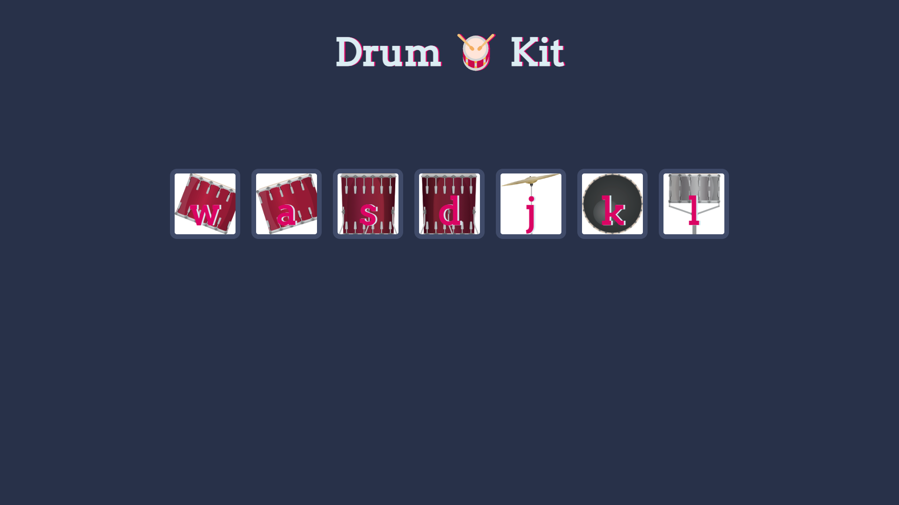

# Drum Kit

The Drum Kit project is a fun web-based application that allows users to play drum sounds by clicking buttons or pressing corresponding keys on their keyboard. 

## Demo

Check out the live demo [here.](#)


## Technologies Used

- **HTML** - For structuring the web page
- **CSS** - For styling the buttons and animations
- **JavaScript** - For adding interactivity and handling user inputs

## Features

- Play different drum sounds by clicking on buttons
- Use keyboard keys (`w`, `a`, `s`, `d`, `j`, `k`, `l`) to play sounds
- Button animations to indicate which key or button was pressed
- Responsive design for a smooth experience across devices

## Getting Started

These instructions will help you run the project on your local machine.

### Installation

1. **Clone the repository**:
   ```bash
   git clone https://github.com/shafayat666/drum-kit.git
   ```
2. Navigate to the project directory:
    ```bash
    cd drum-kit
    ```
3. Open the `indext.html` file in your browser to see the Drum Kit in action.

## Code Explanation

### JavaScript

1. **Event Listeners**:
   - The script uses `addEventListener` to detect both button clicks and keydown events.
   - When a button is clicked or a corresponding key is pressed, it triggers the `playSound` function to play the appropriate drum sound and calls `buttonAnimation` to animate the button.

2. **`playSound(input)` Function**:
   - This function receives an input character (from a button click or key press) and uses a `switch` statement to play the corresponding drum sound using the HTML5 Audio API.

3. **`buttonAnimation(pressedKey)` Function**:
   - Adds a CSS class to the button corresponding to the pressed key to create a visual effect.
   - The class is removed after a short delay to reset the button state.

## Contributing

Contributions are welcome! If you'd like to contribute to this project, follow these steps:

1. Fork the repository.
2. Create a new branch (`git checkout -b feature/YourFeature`).
3. Make your changes and commit them (`git commit -m 'Add some feature'`).
4. Push to the branch (`git push origin feature/YourFeature`).
5. Open a pull request.

